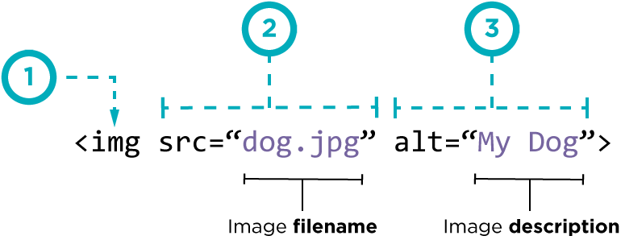

# Images, Color, Text
## Images :
### There are many reasons why you mightmwant to add an image to a web page: youmight want to include a logo, photograph, illustration, diagram, or chart. so how we can add image ? .
### we use  element ; that mean there is not close tage . and two attributes scr this to tell where the image find  and alt to give description of the image if you cannot see it.
### also we can use title attribute to provide additional information for the image .

### heIght & WIdth of Images . we can change The size of images using height and width attributes

### three rules for CreatIng Images
+ saVe Images In the rIght format
+ saVe Images at the rIght sIze
+ use the CorreCt resolutIon
### html5: fIgure and fIgure CaptIon
### now we talk about <figure> element  Images often come with captions. HTML5 has introduced a new <figure> element to contain images and their caption so that the two are associated. You can have more than one image inside the <figure> element as long as they all share the same caption.
### he <figcaption> element has been added to HTML5 in order to allow web page authors to add a caption to an image. Before these elements were created there was no way to associate an  element with its caption.
## Color 
###  three ways to specify color in css:
+ rgb values
+ hex Codes
+ Color names
#### Every color on a computer screen is created by mixing amounts of red, green, and blue. so RGB Values Values for red, green, and blue are expressed as numbers between 0 and 255.and Hex Codes Hex values represent values for red, green, and blue in hexadecimal code , but ColoR Names are represented by predefined names. However, they are very limited in number
#### Contrast : When picking foreground and background colors, it is important to ensure that there is enough contrast for the text to be legible.
### opacity, rgba :
### CSS3 introduces the opacity property which allows you to specify the opacity of an element and any of its child elements. the value is a number between 0.0 and 1.0 (so a value of 0.5 is 50% opacity and 0.15 is 15% opacity).
### The CSS3 rgba property allows you to specify a color, just like you would with an RGB value, but adds a fourth value to indicate opacity. This value is known as an alpha value and is a number between 0.0 and 1.0 .

### Css3: hsl Colors
#### CSS3 introduces an entirely new and intuitive way to specify colors using hue, saturation,and lightness values.
##### Hue is the colloquial idea of color. In HSL colors, hue is often represented as a color circlewhere the angle represents the color, although it may also beshown as a slider with values from 0 to 360.
##### Saturation is the amount of gray in a color. Saturation is represented as a percentage. 100% is full saturation and 0% is a shade of gray.
##### Lightness is the amount of white (lightness) or black(darkness) in a color. Lightness is represented as a percentage. 0% lightness is black, 100% lightness is white, and 50% lightness is normal. Lightness is sometimes referred to as luminosity.
## text 

|typeface Terminology |                          
|:-------------------:|
|       Serif         |   
|    SanS-Serif       |
|      monoSpace      |
|       Weight        |
|     Style           |
|       Stretch       |

### Specifying TypefaceS _font-family
### Size of Type _font-size . There are several ways to specify the size of a font. The most common are:
* pixelS
* percenTageS
* emS
### there are more font choice as @font-face  allows you to use a font, even if it is not installed on the computer of the person browsing, by allowing you to specify a path to a copy of the font, which will be downloaded if it is not on the user's machine . bold font-weight The font-weight property allows you to create bold text. there are two values that this property commonly takes:normal , bold . and italic font-style (italic,normal,oblique). uppercaSe || loWercaSe || capitalize text-transform . text-decoration and it's value none underline overline line-through and blink .leading line-height

### letter-spacing, word-spacing

### alignmenT may be left , right,center ,justify .verTical alignment The vertical-align property is a common source of confusion. It is not intended to allow you to vertically align text in the middle of block level elements such as 
 and 
 , although it does have this effect when used with table cells (the <td> and <th> elements). It is more commonly used with inline elements such as  , <em> , or <strong> elements. When used with these element
##h1{text-align:left;}
### text-indent , text-shadow The value of this property is quite complicated because it can take three lengths and a color for the drop shadow.:first-letter, :first-line Technically these are not properties. They are known as pseudo-elements.STyling linkS :link, :visited reSponding To uSerS :hover, :active, :focus

### aTTribuTe SelecTorS

