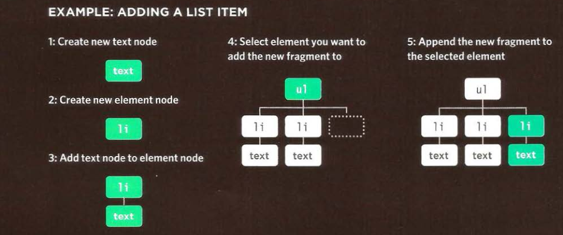

# Problem Domain, Objects, and the DOM
## object 
### an object is a standalone entity, with properties and type. Compare it with a cup, for example. A cup is an object, with properties. A cup has a color, a design, weight, a material it is made of, etc. The same way, JavaScript objects can have properties, which define their characteristics.
### object creating (literal notation)

### accessing an object and dot notation 
#### you can access the proparties or method using dot notation .you can also access the properties with square brackets .
## doucment object model _DOM
### When a web page is loaded, the browser creates a Document Object Model of the page.The HTML DOM model is constructed as a tree of Objects:

### DOM trees have four types of nodes:
+ document nodes .
+ element nodes .
+ attribute nodes, and text nodes.
### accessing and updateing DOM tree involve two steps :
+ locate the node that represent the element you want to work with .
+ use it is text contant ,child element and attributes 
#### caching DOM queries
##### method that find the element in DOM tree are called DOM queries.when you want to use the element more than once ,you should store the result of query in a variable .
#### DOM queries may return one element or nodelist which is a collection of node .
#### methods that select indivedual elements: git element id and query selector can both search an entire document and return indvidual element . both use similar syntax .
#### there are two ways to select an element from node list : the item() method and array syntax .both requier the index of the element that you want .
#### repeating actions for an entire nodelist : when you have a node list , you can loop through each node in the collection and apply the same statments to each.
#### Adding or removing HTML content 
##### there are two way :
+ the inner HTML proparity 
+ DOM mainpolation 

#### attribute node  
##### once you have an element node , you can use other proparties and method on that element node to access and change it's attributes
##### there are two steps to accessing and updating attribute :
+ select the element node and follow it with period symbol .
+ use one of the methods or proparties to work with that element attributes.

