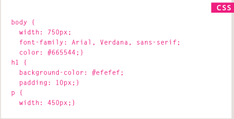
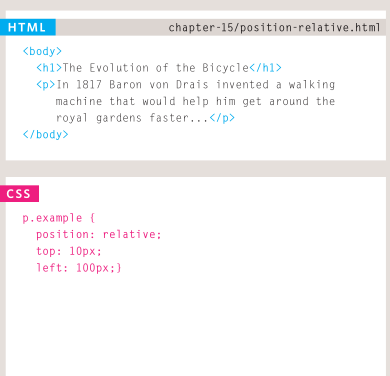
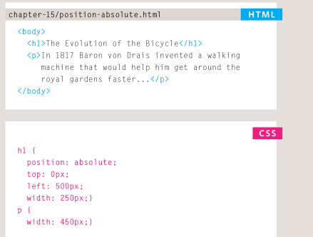

# Layout
## Key ConCepts in positioning eLements
### CSS treats each HTML element as if it is in its own box. This box will either be a block-level box or an inline box.
+ Block-level elements start on a new line Examples include: <h1> 
 <ul> <li>
+ inline elements flow in Between surrounding text Examples include:  <b> <i>
### containing ElEmEnts : if one block-level element sits inside another block-level element then the outer box is known as the containing or parent element.
# A box may be nested inside several other block-level elements. The containing element is always the direct parent of that element.
### ControLLing the position of eLements : CSS has the following positioning schemes that allow you to control the layout of a page: normal flow, relative positioning, and absolute positioning. You specify the positioning scheme using the position property in CSS. You can also float elements using the float property.
### To indicate where a box should be positioned, you may also need to use box offset properties to tell the browser how far from the top or bottom and left or right it should be placed.
+ normal flow (position: static) :in normal flow, each block-level element sits on top of the next one. Since this is the default way in which browsers treat HTML elements, you do not need a CSS property to indicate that elements should appear in normal flow .
+ reLative positioning (position:relative)

+ absolute positioning (position:absolute) : When the position property is given a value of absolute , the box is taken out of normal flow and no longer affects the
position of other elements on the page

+ fixed positioning (position:fixed)
### overallapping elements z-index :When you use relative, fixed, or absolute positioning, boxes can overlap. If boxes do overlap, the elements that appear later in the HTML code sit on top of those that are earlier in the page. If you want to control which element sits on top, you can usethe z-index property. Its valueis a number, and the higher the number the closer that element is to the front. For example, an element with a z-index of 10 will appear over the top of one with a z-index of 5 .
### fLoating eLements (float) : The float property allows you to take an element in normal flow and place it as far to the left or right of the containing element as possible. Anything else that sits insidethe containing element will flow around the element that is floated. When you use the float property, you should also use the width property to indicate how wide the floated element should be. If you do not, results can be inconsistent but the box is likely to take up the full width of the containing element (just like it would in normal flow).
## sCreen sizes : Different visitors to your site will have different sized screens that show different amounts of information, so your design needs to be able to work on a range of different sized screens.
## sCreen resoLution: Resolution refers to the number of dots a screen shows per inch. Some devices have a higher resolution than desktop computers and most operating systems allow users to adjust the resolution of their screens
## page sizes: Because screen sizes and display resolutions vary so much, web designers often try to create pages of around 960-1000 pixels wide (since most users will be able to see designs this wide on their screens).
### Grids help create professional and flexible designs.
### CSS Frameworks provide rules for common tasks.
### You can include multiple CSS files in one page.