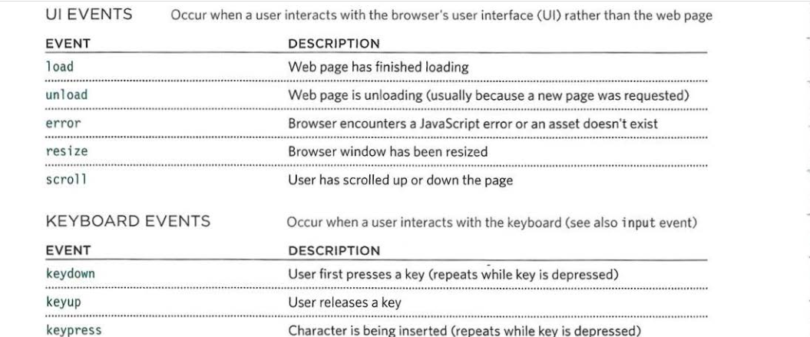
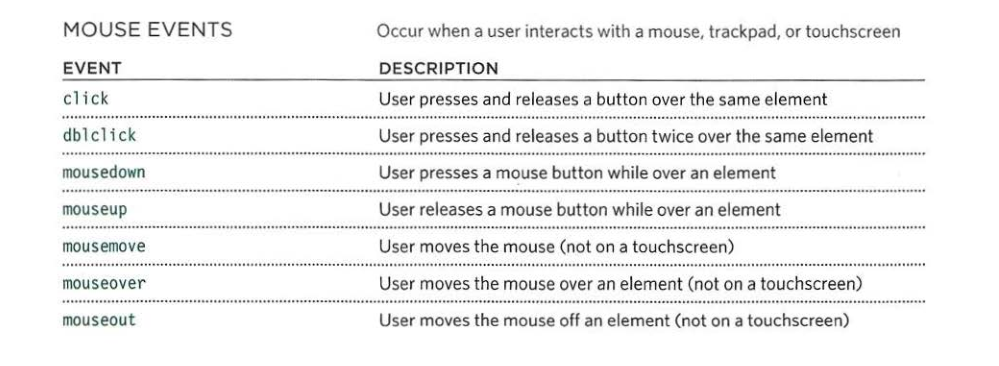
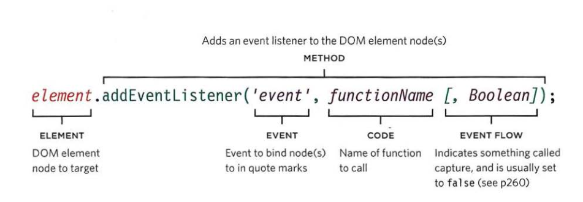

# Forms and JS Events
## forms :
### An HTML form is used to collect user input. The user input is most often sent to a server for processing.A user fills in a form and then presses a button to submit the information to the server.

### form strcture <form> :

### every <form> element have requires an action attribute. Its value is the URL for the page on the server that will receive the information in the form when it is submitted , method Forms can be sent using one of two methods: get or post.
### text input :The **input** element is used to create several different form controls. The value of the type attribute determines what kind of input they will be creating.type="text" When the type attribute has a value of text , it creates a single-line text input. or When the type attribute has a value of password it creates a text box that acts just like a single-line text input, except the characters are blocked out. They are hidden in this way so that if someone is looking over the user's shoulder, they cannot see sensitive data such as passwords.
+ The textarea element is used to create a mutli-line text input. Unlike other input elements this is not an empty element. It should therefore have an opening and a closing tag.
+ input type="radio"Radio buttons allow users to pick just one of a number of options.
+ input type="checkbox" Checkboxes allow users to select (and unselect) one or more options in answer to a question.
+ select A drop down list box (also known as a select box) allows users to select one option from a drop down list.
+ input If you want to allow users to upload a file (for example an image, video, mp3, or a PDF), you will need to use a file input box. type="file" This type of input creates a box that looks like a text inputfollowed by a browse button.
+ input type="submit" The submit button is used to send a form to the server.
### GroupInG Form ElEmEnts You can group related form controls together inside the <fieldset> element. This is particularly helpful for longer forms. The <legend> element can come directly after the opening <fieldset> tag and contains a caption which helps identify the purpose of that group of form controls.

## Lists, tabLes and Forms
### bULLet Point styLes list-style-type : The list-style-type property allows you to control the shape or style of a bullet point (also known as a marker). It can be used on rules that apply to the <ol> , <ul> , and <li> elements.
#### Unordered Lists For an unordered list you can use the following values:
+ none
+ disc
+ circle
+ square
#### ordered Lists :For an ordered (numbered) list you can use the following values:
+ decimal  1 2 3
+ decimal-leading-zero  01 02 03
+ lower-alpha  a b c
+ upper-alpha  A B C
+ lower-roman  i. ii. iii.
+ upper-roman  I II III .
### Positioning the marker list-style-position
+ outside :The marker sits to the left of the block of text .
+ inside The marker sits inside the box of text (which is indented).
### tabLe ProPerties
* width.
* padding
* text-transform 
* letter-spacing, font-size ,text-align ,background-color ,:hover and border-top, border-bottom......
## Events :
### DIFFERENT EVENT TYPES

### THREE WAYS TO BIND AN EVENT TO an ELEMENT
1- HTML EVENT HANDLER ATTRIBUTES (DO NOT USE).
2- TRADITIONAL DOM EVENT HANDLERS .
3- USING DOM EVENT HANDLERS .

