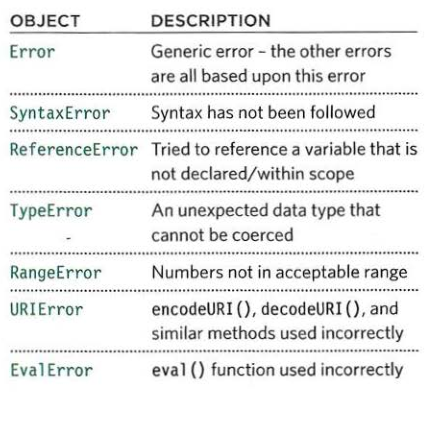
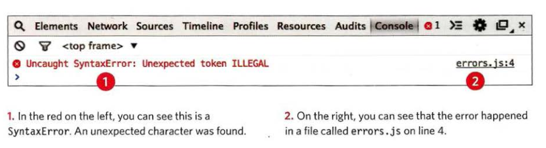
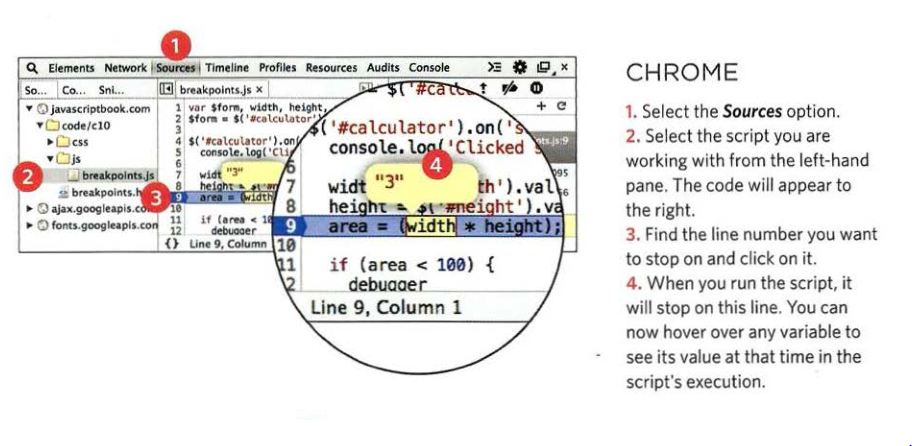

# Debugging
## Error Handling & Debugging
### The JavaScript interpreter uses the concept of execution contexts.There is one global execution context; plus, each function creates a new new execution context. They correspond to variable scope.
#### EXECUTION CONTEXT :Every statement in a script lives in one of three execution contexts:
+ GLOBAL CONTEXT:Code that is in the script, but not in a function.There is only one global context in any page.
+ FUNCTION CONTEXT:Code that is being run wit hin a function.Each function has its own function context.
+ EVAL CONTEXT (NOT SHOWN):Text is executed like code in an internal function called eval().
#### VARIABLE SCOPE :The first two execution contexts correspond with the notion of scope .
+ GLOBAL SCOPE :If a variable is declared outside a function,it can be used anywhere because it has global scope.
+ FUNCTION-LEVEL SCOPE:When a variable is declared within a function,it can only be used  within that function. This is because it has function-level scope.
#### The stack :

#### UND ERSTANDING ERRORS :
##### If a JavaScript statement generates an error, then it throws an exception.At that point, the interpreter stops and looks for exception-handling code.
* ERROR OBJECTS :Error objects can help you find where your mistakes are and browsers have tools to help you read them.
##### There are seven types of built-in error objects in JavaScript.

#### HOW TO DEAL WITH ERRORS :there are two things you can do with the errors.
1- DEBUG THE SCRIPT TO FIX ERRORS.
2- HANDLE ERRORS GRACEFULLY.
##### HOW TO LOOK AT ERRORS IN CHROME : The console will show you when there is an error in your JavaScript. It also displays the line where it became a problem for the interpreter.
##### To diff erentiate between then types of messages you write to the console, you can use three different met hods. They use various colors and icons to distinguish them:
1. conso1e.info() can be used for general information.
2. console.warn() can be used for warnings
3. console.error() can be used to hold errors
##### BREAK POINTS:You can pause the execution of a script on any line using breakpoints. then you can check the values stored in variables at that point in time.You can indicate that a breakpoint should be triggered only if a condition that you specify is met. The condition can use existing variabl es.

