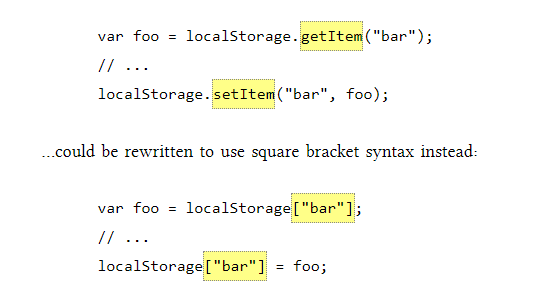
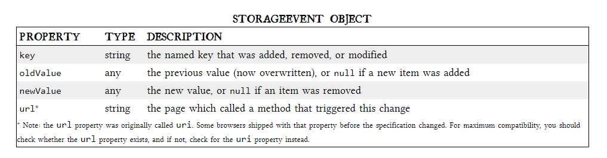

# Local Storage

## introducing to HTML5 storage :  it’s a way for web pages to store named key/value pairs locally, within the client web browser.  this data persists even after you navigate away from the web site, close your browser tab, exit your browser, or what have you. but this data is never transmitted to the remote web server (unless you go out of your way to send it manually). Unlike all previous attempts at providing persistent local storage, it is implemented natively in web browsers, so it is available even when third-party browser plugins are not.

### From your JavaScript code, you’ll access HTML5 Storage through the localStorage object on the global window object, you can use Modernizr to detect support for HTML5 Storage.
## using HTML5 storage 
### HTML5 Storage is based on named key/value pairs. You store data based on a named key, then you can retrieve that data with the same key. The named key is a string. The data can be any type supported by JavaScript, including strings, Booleans, integers, or floats. However, the data is actually stored as a string. If you are storing and retrieving anything other than strings, you will need to use functions like parseInt() or parseFloat() to coerce your retrieved data into the expected JavaScript datatype.
### Calling setItem() with a named key that already exists will silently overwrite the previous value. Calling getItem() with a non-existent key will return null rather than throw an exception.
### Like other JavaScript objects, you can treat the localStorage object as an associative array. Instead of using the getItem() and setItem() methods, you can simply use square brackets.  

### There are also removeItem() methods for removing the value for a given named key, and clearing the entire storage area (that is, deleting all the keys and values at once).
## tracking changes to the HTML5 storage area :
### If you want to keep track programmatically of when the storage area changes, you can trap the storage event. The storage event is fired on the window object whenever setItem(), removeItem(), or clear() is called and actually changes something. For example, if you set an item to its existing value or call clear() when there are no named keys, the storage event will not fire, because nothing actually changed in the storage area.

## limitations in current browsers
### HTML5 Storage, we can save the progress locally, within the browser itself. Here is a live demonstration. Make a few moves, then close the browser tab, then re-open it. If your browser supports HTML5 Storage, the demonstration page should magically remember your exact position.

