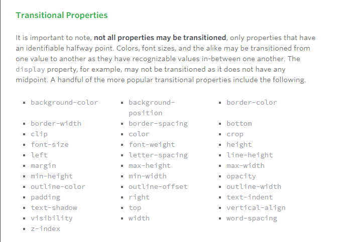

# CSS Transforms, Transitions, and Animations
## Transforms 
### The actual syntax for the transform property is quite simple, including the transform property followed by the value. The value specifies the transform type followed by a specific amount inside parentheses.
### 2D Transforms
#### Elements may be distorted, or transformed, on both a two-dimensional plane or a three-dimensional plane. Two-dimensional transforms work on the x and y axes, known as horizontal and vertical axes. Three-dimensional transforms work on both the x and y axes, as well as the z axis. These three-dimensional transforms help define not only the length and width of an element, but also the depth
#### 2D rotat :The transform property accepts a handful of different values. The rotate value provides the ability to rotate an element from 0 to 360 degrees. Using a positive value will rotate an element clockwise, and using a negative value will rotate the element counterclockwise. The default point of rotation is the center of the element, 50% 50%, both horizontally and vertically. Later we will discuss how you can change this default point of rotation.
#### 2D Scale:Using the scale value within the transform property allows you to change the appeared size of an element. The default scale value is 1, therefore any value between .99 and .01 makes an element appear smaller while any value greater than or equal to 1.01 makes an element appear larger.
##### It is possible to scale only the height or width of an element using the scaleX and scaleY values. The scaleX value will scale the width of an element while the scaleY value will scale the height of an element. To scale both the height and width of an element but at different sizes, the x and y axis values may be set simultaneously. To do so, use the scale transform declaring the x axis value first, followed by a comma, and then the y axis value.
#### 2D Translate: The translate value works a bit like that of relative positioning, pushing and pulling an element in different directions without interrupting the normal flow of the document. Using the translateX value will change the position of an element on the horizontal axis while using the translateY value will change the position of an element on the vertical axis.
#### 2D Skew :The last transform value in the group, skew, is used to distort elements on the horizontal axis, vertical axis, or both. The syntax is very similar to that of the scale and translate values. Using the skewX value distorts an element on the horizontal axis while the skewY value distorts an element on the vertical axis. To distort an element on both axes the skew value is used, declaring the x axis value first, followed by a comma, and then the y axis value.%p
#### Combining Transforms: It is common for multiple transforms to be used at once, rotating and scaling the size of an element at the same time for example. In this event multiple transforms can be combined together. To combine transforms, list the transform values within the transform property one after the other without the use of commas.
#### Transform Origin: As previously mentioned, the default transform origin is the dead center of an element, both 50% horizontally and 50% vertically. To change this default origin position the transform-origin property may be used.

##### The transform-origin property can accept one or two values. When only one value is specified, that value is used for both the horizontal and vertical axes. If two values are specified, the first is used for the horizontal axis and the second is used for the vertical axis.
#### Perspective: In order for three-dimensional transforms to work the elements need a perspective from which to transform. The perspective for each element can be thought of as a vanishing point, similar to that which can be seen in three-dimensional drawings.

##### The perspective of an element can be set in two different ways. One way includes using the perspective value within the transform property on individual elements, while the other includes using the perspective property on the parent element residing over child elements being transformed.
## Transitions & Animations 
### As mentioned, for a transition to take place, an element must have a change in state, and different styles must be identified for each state. The easiest way for determining styles for different states is by using the :hover, :focus, :active, and :target pseudo-classes.
### There are four transition related properties in total, including transition-property, transition-duration, transition-timing-function, and transition-delay. Not all of these are required to build a transition, with the first three are the most popular.

### The transition-property property determines exactly what properties will be altered in conjunction with the other transitional properties. By default, all of the properties within an element’s different states will be altered upon change. However, only the properties identified within the transition-property value will be affected by any transitions.

### Transition Duration: The duration in which a transition takes place is set using the transition-duration property. The value of this property can be set using general timing values, including seconds (s) and milliseconds (ms). These timing values may also come in fractional measurements, .2s for example.

#### When transitioning multiple properties you can set multiple durations, one for each property. As with the transition-property property value, multiple durations can be declared using comma separated values. The order of these values when identifying individual properties and durations does matter. For example, the first property identified within the transition-property property will match up with the first time identified within the transition-duration property, and so forth.
### Transition Timing: The transition-timing-function property is used to set the speed in which a transition will move. Knowing the duration from the transition-duration property a transition can have multiple speeds within a single duration. A few of the more popular keyword values for the transition-timing-function property include linear, ease-in, ease-out, and ease-in-out.

#### The linear keyword value identifies a transition moving in a constant speed from one state to another. The ease-in value identifies a transition that starts slowly and speeds up throughout the transition, while the ease-out value identifies a transition that starts quickly and slows down throughout the transition. The ease-in-out value identifies a transition that starts slowly, speeds up in the middle, then slows down again before ending.

#### Each timing function has a cubic-bezier curve behind it, which can be specifically set using the cubic-bezier(x1, y1, x2, y2) value. Additional values include step-start, step-stop, and a uniquely identified steps(number_of_steps, direction) value.
### Transition Delay: On top of declaring the transition property, duration, and timing function, you can also set a delay with the transition-delay property. The delay sets a time value, seconds or milliseconds, that determines how long a transition should be stalled before executing. As with all other transition properties, to delay numerous transitions, each delay can be declared as comma separated values.
## Animations 
### Transitions do a great job of building out visual interactions from one state to another, and are perfect for these kinds of single state changes. However, when more control is required, transitions need to have multiple states. In return, this is where animations pick up where transitions leave off.

### Animations Keyframes: o set multiple points at which an element should undergo a transition, use the @keyframes rule. The @keyframes rule includes the animation name, any animation breakpoints, and the properties intended to be animated.

### Animation Name: Once the keyframes for an animation have been declared they need to be assigned to an element. To do so, the animation-name property is used with the animation name, identified from the @keyframes rule, as the property value. The animation-name declaration is applied to the element in which the animation is to be applied to.
### Animation Duration, Timing Function, & Delay: Once you have declared the animation-name property on an element, animations behave similarly to transitions. They include a duration, timing function, and delay if desired. To start, animations need a duration declared using the animation-duration property. As with transitions, the duration may be set in seconds or milliseconds.
### A timing function and delay can be declared using the animation-timing-function and animation-delay properties respectively. The values for these properties mimic and behave just as they do with transitions.
### Animation Iteration: By default, animations run their cycle once from beginning to end and then stop. To have an animation repeat itself numerous times the animation-iteration-count property may be used. Values for the animation-iteration-count property include either an integer or the infinite keyword. Using an integer will repeat the animation as many times as specified, while the infinite keyword will repeat the animation indefinitely in a never ending fashion.
## 8 SIMPLE CSS3 TRANSITIONS THAT WILL WOW YOUR USERS
### All of these effects (bar one) are controlled with the transition property. 
### The transition property has three values: the properties to transition , the speed of the transition  and a third value which lets you change how the acceleration and deceleration is calculated.

1. Fade in: Having things fade in is a fairly common request from clients. It’s a great way to emphasize functionality or draw attention to a call to action.Fade in effects are coded in two steps: first, you set the initial state; next, you set the change.
2. Change color.
3. Grow & Shrink.
4. Rotate elements
5. Square to circle: using border-radus:50%;
6. 3D shadow:using box-shadow and transform:translatex.
7. Swing: Not all elements use the transition property. We can also create highly complex animations using @keyframes, animation and animation-iteration.In this case, we’ll first define a CSS animation in your styles. You’ll notice that due to implementation issues, we need to use @-webkit-keyframes as well as @keyframes (yes, Internet Explorer really is better than Chrome, in this respect at least).
8. Inset border